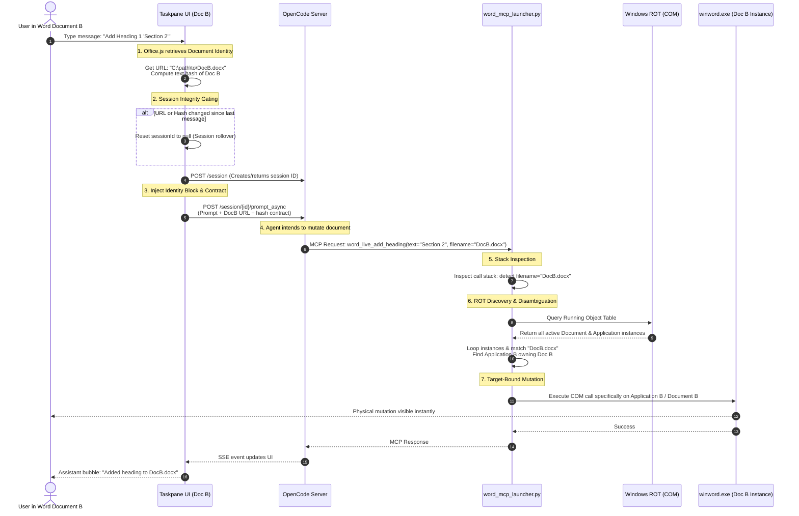

# Multi-Document & Multi-Instance Workflow

This diagram illustrates how the task pane, OpenCode agent, and `word_mcp_launcher` wrapper coordinate to ensure mutations target the correct file when you have multiple documents or instances of Word desktop running simultaneously.

## 1. High-Level Architecture & Binding Flow

## 2. Key Safety Guardrails

### A. Saved Documents
For a document saved to a path (e.g. `DocB.docx`):
1. **Identify**: The task pane gets `Office.context.document.url` (`C:\path\to\DocB.docx`).
2. **List**: The agent calls `word_live_list_open` to list documents known to COM.
3. **Match**: The agent matches `C:\path\to\DocB.docx` or `DocB.docx` to exactly one open COM document.
4. **Target**: The agent passes `filename="DocB.docx"` to all subsequent edits.
5. **Fail Closed**: If no match or multiple matches exist, the agent stops and prompts you to resolve the conflict.

### B. Unsaved Documents
For a newly created unsaved document (e.g. `Document1`):
1. **Nonce Generation**: The task pane generates a session nonce (e.g. `nonce-3g7k9s2a`).
2. **List Check**: The agent calls `word_live_list_open`.
3. **Guard**: 
   * If **exactly one** unsaved document is open globally, the agent prompts: *"I see only one unsaved document. Please confirm if you want me to edit this."*
   * If **two or more** unsaved documents are open, the agent **fails closed** and asks you to save the document first to prevent guessing target windows.
